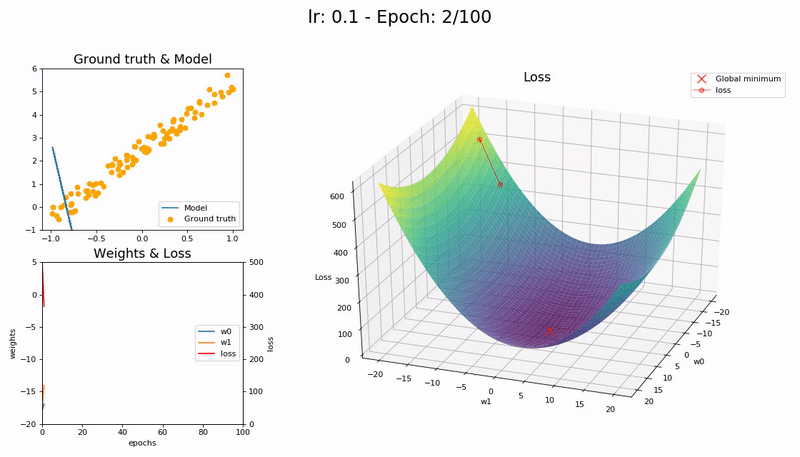
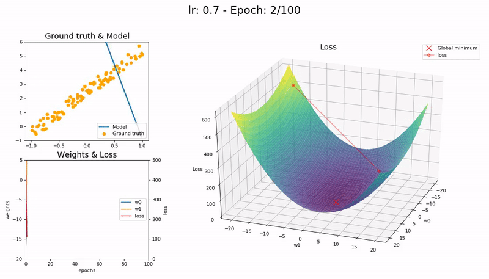
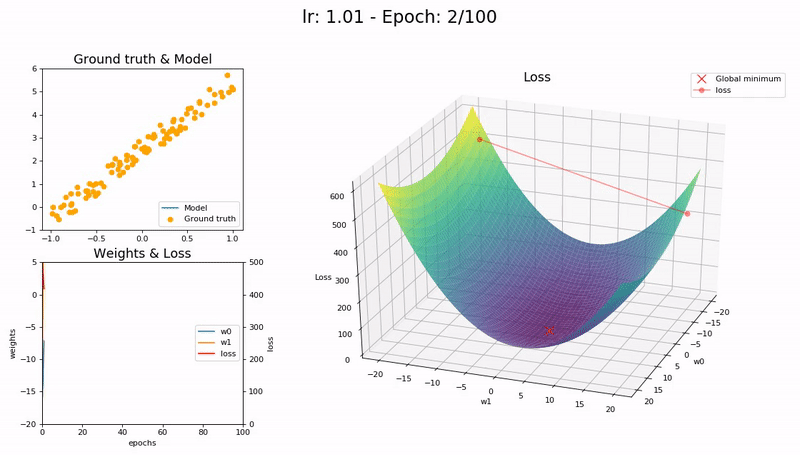

# Learning Rate 관련 문제
> **원본 주소 :** https://iconof.com/1cycle-learning-rate-policy/  
> **번역 철학 :** 매끄럽게 읽으실 수 있는 적절한 의역을 지향합니다.  
> **전문 용어 :** 가급적 <a href='http://taewan.kim/docs/ml_glossary/'>우리말 용어</a>를 사용하고자 하며, 원어를 병기합니다.  

심층신경망(DNN: Deep Neural Network)은 어려운 전역 최적화 문제다.  
학습률(LR: Learning Rate)은 심층신경망 학습 조정에 결정적인 hyper-parameter인데, 학습률이 작으면 학습이 느려지고 너무 큰 값을 취하면 손실 함수 수렴이 어려워져 최소값 근처를 맴돌기만 하거나, 심지어 발산하기도 한다.  

**학습률이 너무 작을 때 (0.01)** 100 epoch 이내 수렴에 실패한다. 더 많은 Epoch - 그리고 시간 - 이 필요하다:  
  

**학습률이 좋을 때 (0.1)** 100 epoch 안에 성공적으로 수렴한다:  
  

**학습률이 최적값일 때 (0.7)** 매우 빠르게, 10 epoch 안에 수렴한다:  
  

**학습률이 클 때 (0.99)** 손실 함수가 최소값 근처를 오갈 뿐 모델이 수렴하지 않는다:  
  

**학습률이 매우 클 때 (1.01)** 모델이 빠르게 *발산*한다:  
  

(Graph 제공 : <a href='https://forums.fast.ai/t/share-your-work-here/27676/300'>José Fernández Portal</a>)  

학습률이 낮으면 느리지만 정확하다. 학습률이 증가함에 따라 학습 속도는 따라 증가하지만 학습률이 너무 커지면 발산을 해 버린다. 최적점(sweet spot)을 찾으려면 경험과 인내가 필요하다. 학습률 최적화를 자동화하는 한 가지 방법은 격자 탐색법(grid search)인데, 시간이 많이 소요된다.  

실질적으로, 학습률은 정해져이씨 않으며 학습 과정에 걸쳐 변화한다. (속도 관점에서) 최적 학습률로 시작하고, (정확성 측면에서) 학습이 마무리될 때 쯤 서서히 줄어드는 것이 바람직하다. 이를 위한 방법으로 <a href='https://towardsdatascience.com/learning-rate-schedules-and-adaptive-learning-rate-methods-for-deep-learning-2c8f433990d1'>학습률 스케줄(learning rate schedule)과 적응적 학습률(adaptive learning rate) 방법</a>이 있다.  

학습률 스케줄은 특정 전략(시간 기반 감소(Time-Based Decay), 단계 감소(Step Decay), 지수 감소(Exponential Decay) 등)에 따라 학습률을 감소시키는 수학 공식이다. 학습이 개시되기 전에 정의되어 학습이 진행되는 동안 동일하게 적용된다. 그러므로 데이터셋의 특성을 반영하여 변화를 주는 것이 불가능하다. 적응적 학습률(Adagrad, Adadelta, RMSprop, Adam 등)은 이 문제를 완화할 수 있지만 더 많은 계산을 요구한다. 보다 깊은 공부를 원한다면 "<a href='http://arxiv.org/abs/1609.04747'>An overview of gradient descent optimization algorithms</a>"를 권한다.  

