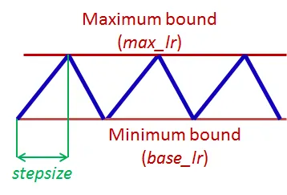
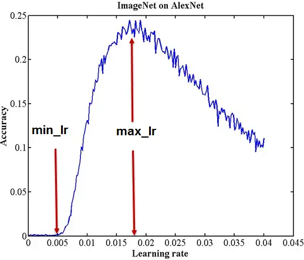

# Fast.ai의 fit_one_cycle method 이해하기
> **원본 주소 :** https://iconof.com/1cycle-learning-rate-policy/  
> **번역 철학 :** 매끄럽게 읽으실 수 있는 적절한 의역을 지향합니다.  
> **전문 용어 :** 가급적 <a href='http://taewan.kim/docs/ml_glossary/'>우리말 용어</a>를 사용하고자 하며, 원어를 병기합니다.  
<br>

* 본 글은 번역글입니다.
* 2019년 8월 14일에 번역한 글을 다듬어 새로 올립니다.

> <b>원본 주소 :</b> https://iconof.com/1cycle-learning-rate-policy/  
> <b>번역 철학 :</b> 매끄럽게 읽으실 수 있는 적절한 의역을 지향합니다.  
> <b>전문 용어 :</b> 가급적 <a href='http://taewan.kim/docs/ml_glossary/'>우리말 용어</a>를 사용하고자 하며, 원어를 병기합니다.  

### 한 줄 요약

* `fit_one_cycle()`은 큰 값의 주기적 학습률(cyclical learning rates)을 적용해서 학습이 매우 빠르고 정확합니다.

Fast.ai에서 딥러닝 모델을 학습할 때 `fit()`보다 속도와 정확성 측면에서 `fit_one_cycle()`사용이 바람직합니다. 한 마디로 말하자면 `fit_one_cycle()`은 Leslie Smith의 <b>1주기 정책(1cycle policy)</b> 을 Fast.ai에 탑재한 것인데, Smith는 아래 세 편의 논문에서 그의 방법론을 상세하게 설명했습니다.  

1. <a href='http://arxiv.org/abs/1506.01186'>Cyclical Learning Rates for Training Neural Networks</a> (2017)
2. <a href='http://arxiv.org/abs/1708.07120'>Super-Convergence: Very Fast Training of Neural Networks Using Large Learning Rates</a> (2018)
3. <a href='http://arxiv.org/abs/1803.09820'>A disciplined approach to neural network hyper-parameters: Part1 - learning rate, batch size, momentum, and weight decay</a> (2018)

아래 글에서 1주기 정책의 기저에 깔려있는 개념을 살펴보고 기존 방법론보다 더 잘 작동하는 이유를 살펴보겠습니다.

### Learning Rate 관련 문제

심층신경망(DNN: Deep Neural Network)은 어려운 전역 최적화 문제입니다.  
학습률(LR: Learning Rate)은 심층신경망 학습 조정에 결정적인 하이퍼 파라미터인데, 학습률이 작으면 학습이 느려지고 너무 큰 값을 취하면 손실 함수 수렴이 어려워져 최소값 근처를 맴돌기만 하거나 심지어 발산하기도 합니다.  

* <b>학습률이 너무 작을 때 (0.01).</b>  
  100 epoch 이내 수렴에 실패합니다. 더 많은 Epoch과 시간이 필요합니다.  
    


* <b>학습률이 좋을 때 (0.1).</b> 
  100 epoch 안에 성공적으로 수렴합니다.
    
  

* <b>학습률이 최적값일 때 (0.7).</b>  
  매우 빠르게, 10 epoch 안에 수렴합니다.  
    
  

* <b>학습률이 클 때 (0.99).</b> 
  손실 함수가 최소값 근처를 오갈 뿐 모델이 수렴하지 않습니다.
    


* <b>학습률이 매우 클 때 (1.01).</b>
  모델이 빠르게 <b>발산</b>합다:  
    

  (Graph 제공 : <a href='https://forums.fast.ai/t/share-your-work-here/27676/300'>José Fernández Portal</a>)  

학습률이 낮으면 느리지만 정확합니다. 학습률이 증가함에 따라 학습 속도는 따라 증가하지만 학습률이 너무 커지면 발산을 해 버립니다. 최적점(sweet spot)을 찾으려면 경험과 인내가 필요합니다. 학습률 최적화를 자동화하는 한 가지 방법은 격자 탐색법(grid search)인데, 시간이 많이 소요됩니다.  

실질적으로, 학습률을 고정하는 방법보다 학습 과정에 걸쳐 변화시키는 방법이 많이 사용됩니다. (속도 관점에서) 최적 학습률로 시작하고, (정확성 측면에서) 학습이 마무리 될 때 쯤 서서히 줄어드는 것이 바람직합니다. 이를 위한 방법으로 <a href='https://towardsdatascience.com/learning-rate-schedules-and-adaptive-learning-rate-methods-for-deep-learning-2c8f433990d1'>학습률 스케줄(learning rate schedule)과 적응적 학습률(adaptive learning rate) 방법</a>이 있습니다.  

학습률 스케줄은 특정 전략, 예를 들어 시간 기반 감소(Time-Based Decay), 단계 감소(Step Decay), 지수 감소(Exponential Decay) 등 수식에 따라 학습률을 감소시키는 방식입니다. 스케줄은 학습이 개시되기 전에 정의되고 학습이 진행되는 동안 동일하게 적용됩니다. 그러므로 데이터셋의 특성을 반영하여 변화를 주는 것이 불가능합니다. 적응적 학습률(Adagrad, Adadelta, RMSprop, Adam 등)은 이 문제를 완화할 수 있지만 더 계산량을 많이 요구합니다. 보다 깊은 공부를 원한다면 "<a href='http://arxiv.org/abs/1609.04747'>An overview of gradient descent optimization algorithms</a>"를 읽어보기를 권합니다.  


   
### 주기적 학습률 (CLR: Cyclical Learning Rates)  

Smith는 학습률을 새롭게 설정하는 방법을 발견하고 [주기적 학습률(Cyclical Learning Rate)](http://arxiv.org/abs/1506.01186)이라는 이름을 붙였습니다. 학습률이 고정되거나 감소하는 대신 CLR는 학습률이 <b>합리적인</b> 최소값과 최대값 사이를 지속적으로 오가는 것을 허용합니다.  

하나의 CLR 주기는 학습률이 증가하고 감소하는 두 단계로 이루어지며, 각 단계엔 스텝 크기(<b>stepsize</b>)가 있는데, 학습률이 증가하고 감소하는 횟수를 의미합니다(예. 1k, 5k 등). 구체적으로, 스텝 크기가 `5,000`인 CLR 주기는 총 `5,000 + 5,000 = 10,000`번의 반복으로 구성됩니다. 

<p align="center">
  
</p>

CLR은 계산 비용이 비싸지도 않습니다. 가장 좋은 학습률을 찾을 이유 자체가 없습니다. <b>최적</b>의 학습률은 최소값과 최대값 사이 어딘가에 놓여 있을 것이기 때문입니다. 주기적 학습률은 신경망의 성능을 일시적으로 떨어트릴 수 있음에도 불구하고 전반적으로 더 좋은 결과를 보입니다.  

<p align="center">
  
</p>

위 그림은 CIFAR-10 데이터셋을 대상으로 70,000번의 반복 수행을 실시한 학습 정확도입니다. 고정 학습률(청색)은 70,000 반복 수행 후 81.4%의 정확도를 보이는 반면, CLR(적색)은 25,000 회 반복 수행 후 같은 값을 달성했습니다.  


> **"본 학습률 정책의 본질은 학습률을 증가시키면 단기적으로는 부정적 효과를 유발하지만 장기적으로 이익이라는 것입니다."**  
> **Smith**

<br>  

주기적 학습률은 안장점 대응에 효과적입니다. 안장점에서는 기울기가 작아(평면 등) 학습률이 작을 때 학습이 느려질 수 있는데, 이런 장애물을 넘어가는 가장 좋은 방법은 기울기가 높은 곡면을 만날 때까지 학습률을 높이는 것입니다. CRL의 학습률 증가는 바로 이런 일을 하는 것입니다. 효과적으로요.  

<p align="center">
  
</p>
<br>  

#### 학습률 범위 테스트 (Learning Rate range test)

Smith는 <b>학습률 범위 테스트</b>라고 하는, 학습률의 합리적인 최소값과 최대값을 평가하는 방법을 고안하기도 했습니다. 바로 학습률을 낮게 시작해서 높은 값까지 선형적으로 키우며 모델을 수 에포크동안 실행하는 방식입니다. 아래의 <b>정확도와 학습률</b> 그래프를 보면 정확도가 높아지다가 증가 속도 감소와 함께 오락가락하다가 떨어지는데, 여기서 학습률의 최소값과 최대값의 좋은 후보 지점을 두 개 도출할 수 있습니다.  

<p align="center">
  
</p>

이후 주기적 학습률의 범위를 이 두 값 사이로 설정한 분류 모델은 아키텍처가 어떤 범위를 벗어나지 않는다면 계산 비용이 크게 증가하는 일 없이 준수한 분류 결과를 도출할 것입니다.  

   
### 1주기 정책(1cycle policy)과 빠른 수렴(Super-convergence)

본인의 CLR 연구에 기반하여 Smith는 <a href='http://arxiv.org/abs/1708.07120'>빠른 수렴에 대한 후속 연구</a>를 발표했습니다.  
여기서 빠른 수렴은 <b>신경망이 일반적인 학습 방법론에 비해 10배 이상 빠르게 학습될 수 있는 현상</b>을 말합니다.  
  
빠른 수렴은 CLR을 사용하되, (학습률 증가와 감소 두 단계로 이루어진) 주기 딱 하나와 큰 범위의 학습률을 적용합니다. 이 때 주기의 크기는 에포크 당 전체 반복 횟수보다 작아야 합니다 (역자주: 학습률이 증가하고 내려가는 스텝이 한 에포크를 다 채우지 말아야 한다는 의미입니다). 이 주기가 만료된 후 한 에포크에 남은 여분의 반복 횟수에는 초기값보다 몇 자리 줄인 학습률을 적용합니다. Smith는 이 방법에 <b>1주기 정책(1cycle policy)</b>이라는 이름을 붙였습니다.

풀어서 설명하면, 빠른 수렴에서 학습률은 낮은 값으로 시작하여 매우 큰 값으로 증가하고, 다시 초기값보다 훨씬 낮은 값으로 감소합니다. 이와 같은 학습률의 변동은 매우 독특한 <b>학습 정확도</b> 곡선을 보입니다. 통상적인 학습 정확도 곡선은 학습률이 바뀌면 값이 점점 커지다가 평탄해지는 것이 보통인데 (아래 그림의 청색 실선 참고), 빠른 수렴의 학습 곡선(아래 그림의 적색 실선)은 초반 학습률 상승에 따른 급상승 이후 진동 또는 (학습률이 매우 클 때) 일부 감소하다가 다시 (학습률이 매우 낮은 값으로 떨어졌을 때) 특이한 급상승을 보입니다.

<p align="center">
  
</p>

Smith는 높은 학습률이 규제(regularization)와 마찬가지로 작용함을 밝혀냈습니다.  
그러므로 1주기 정책을 적용할 때 다른 규제 방법론(배치 크기(batch size), 모멘텀, 가중치 감소(weight decay) 등)은 약화되어야 합니다.

### Fastai에는 1주기 정책이 이렇게 이식되어 있습니다.

Fastai는 1주기 정책의 상세 부분을 모두 추상화하여 `fit_one_cycle()` 형태의 직관적인 인터페이스를 제공합니다.  
내부적으로 `fit()` 함수를 `OneCycleScheduler` callback 과 함께 호출하는 방식입니다.
```python
def fit_one_cycle(learn:Learner, cyc_len:int,
    max_lr:Union[Floats,slice]=defaults.lr, moms:Tuple[float,float]=(0.95,0.85),
    div_factor:float=25., pct_start:float=0.3, wd:float=None,
    callbacks:Optional[CallbackList]=None, tot_epochs:int=None,
    start_epoch:int=1)->None:
    "Fit a model following the 1cycle policy."

    max_lr = learn.lr_range(max_lr)
    callbacks = listify(callbacks)
    callbacks.append(OneCycleScheduler(learn, max_lr, moms=moms,
      div_factor=div_factor, pct_start=pct_start,
      tot_epochs=tot_epochs,start_epoch=start_epoch))
    
    learn.fit(cyc_len, max_lr, wd=wd, callbacks=callbacks)
```

`fit_one_cycle()` 함수를 몇 개의 기본적인 인자와 함께 호출함으로써 1주기 정책의 장점을 누리기 바랍니다.

<a href='https://twitter.com/mavropalias'>원저자의 Twitter를 Follow하시려면 클릭하세요</a>
