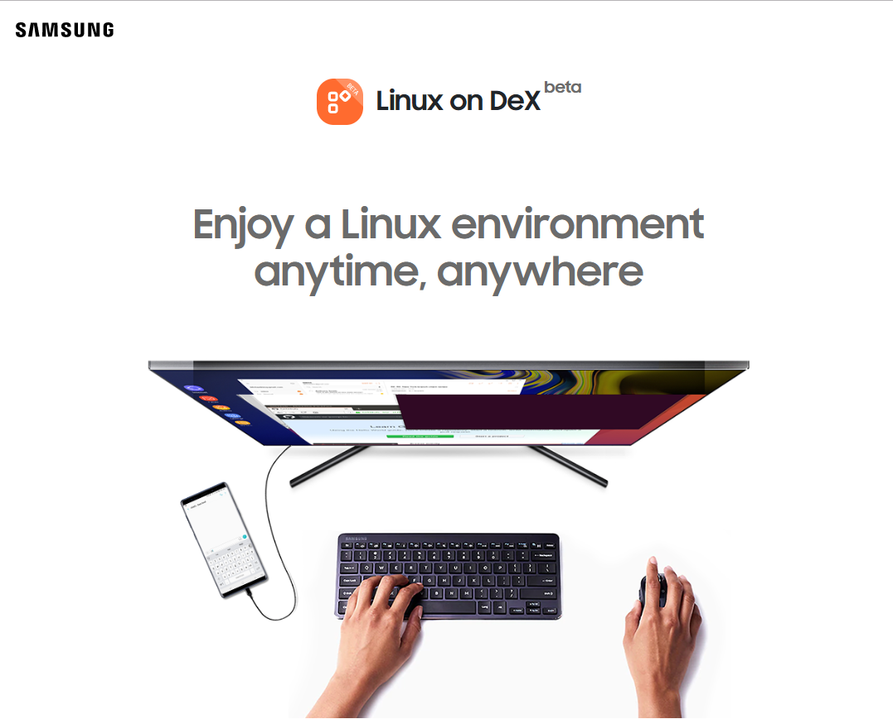
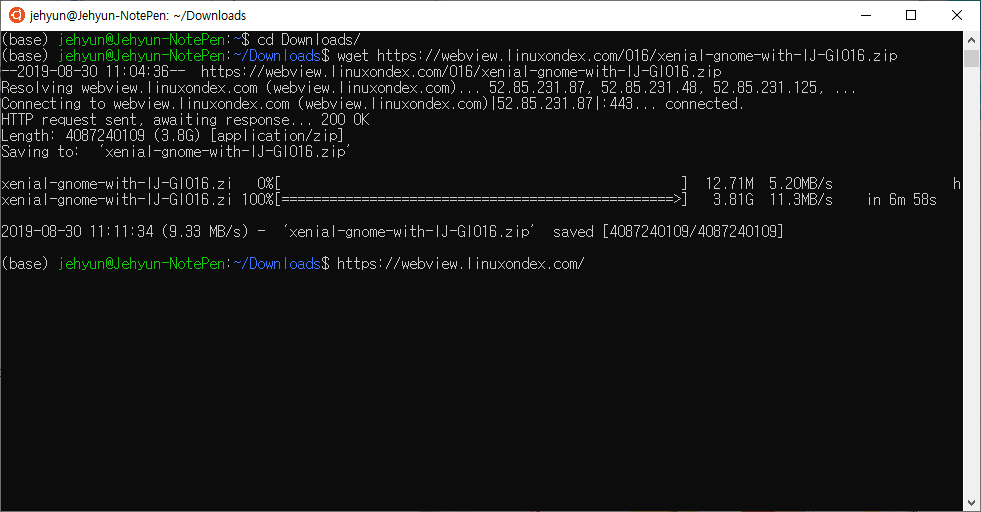
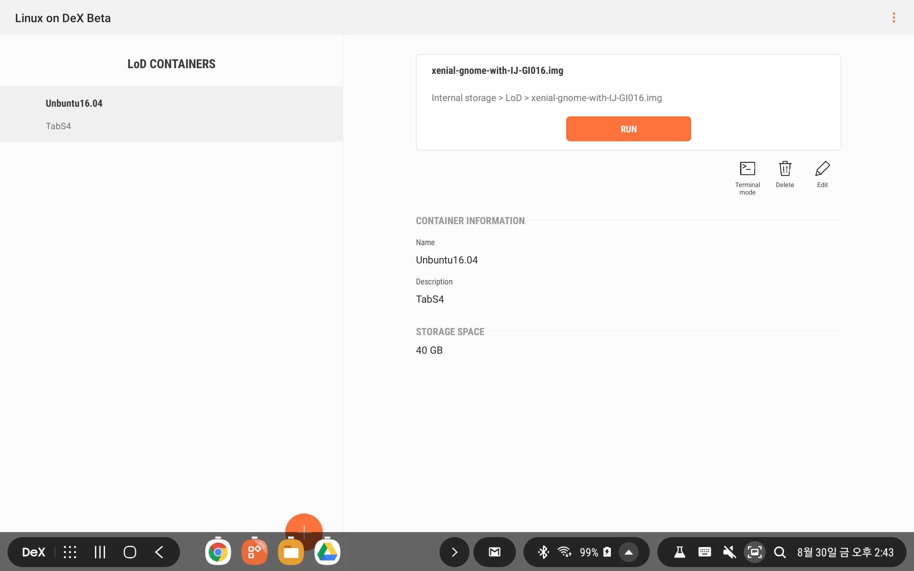
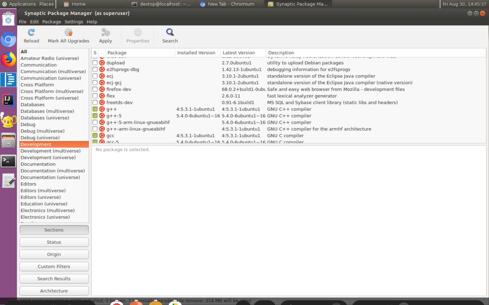
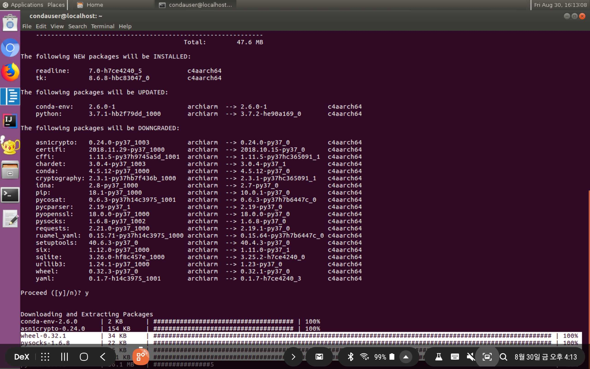
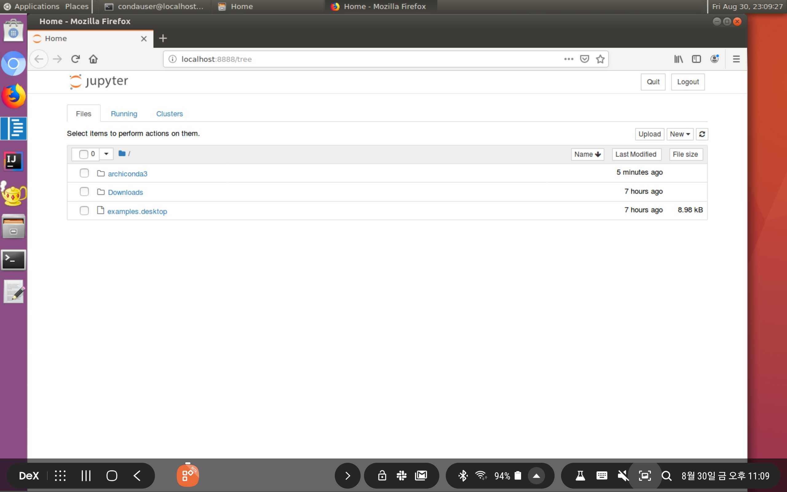
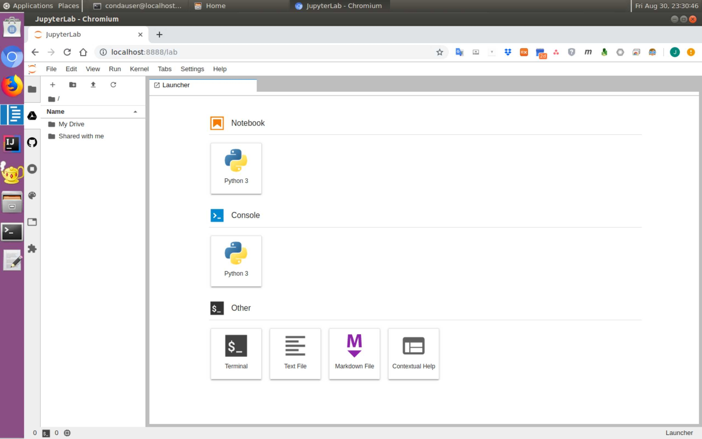
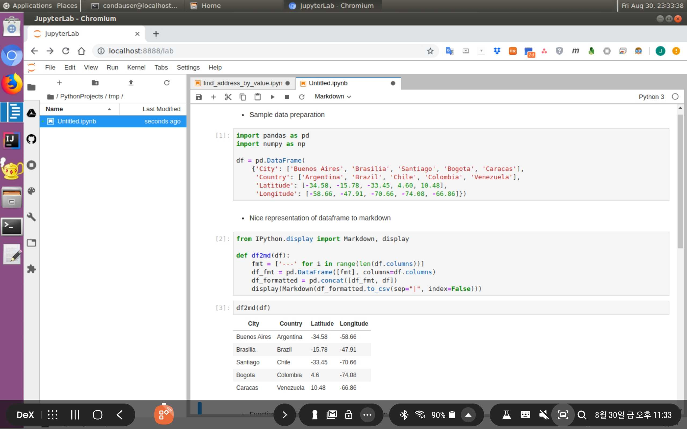
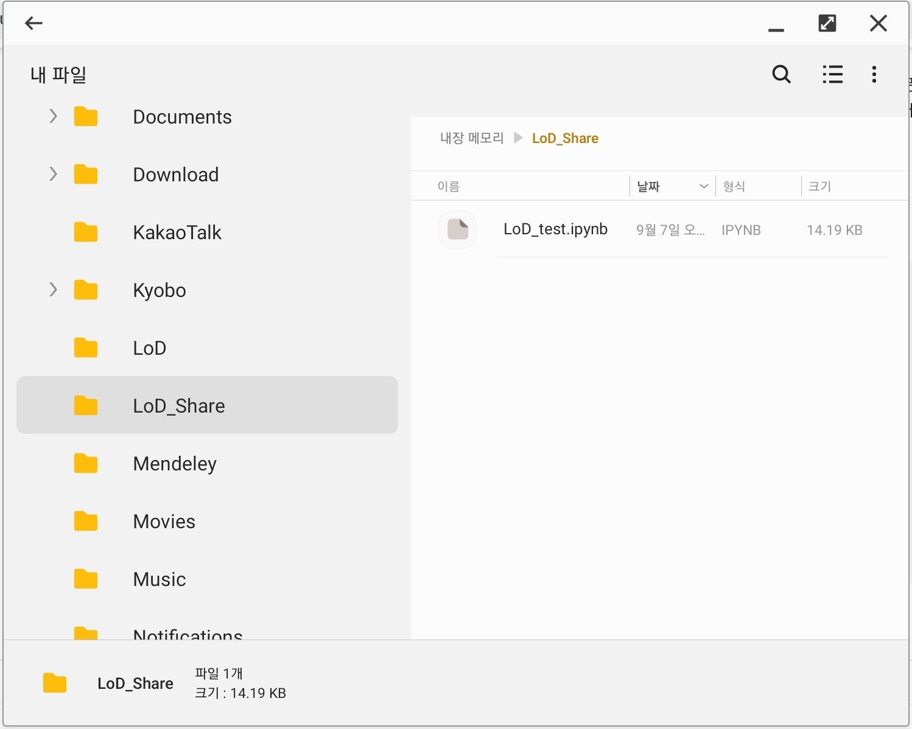

# Samsung Android 기기에서 Linux 사용하기  

> **세 줄 요약**
> 1) 삼성 안드로이드 제품에 Linux를 설치하고 사용할 수 있음.  
> 2) 그런데 비공식 노가다가 조금 필요함.  
> 3) anaconda + jupyter lab (Google Drive 연동, GitHub 연동) 까지 성공함.


삼성이 자사의 Android 기기에서 Linux를 사용할 수 있는 환경을 제공합니다. `Dex`환경을 이용한 것이기 때문에 아래에 설명드릴 기술은 삼성 안드로이드(폰, 태블릿)에서만 작동되며, 그것도 비교적 최신 모델에 한해 기능이 제공됩니다.    
`VScode`와 `IntelliJ`가 탑재되어 있는 것을 보면 어디서든 개발을 하고자 하는 이들을 노린 것으로 보입니다.  
[`Linux on Dex`](https://www.linuxondex.com/)가 그 이름으로, 상세한 정보는 [공식 홈페이지](https://www.linuxondex.com/)와 [Gaiar Baimuratov의 포스팅](https://towardsdatascience.com/pydata-stack-in-your-pocket-literally-73662c20d18e)을 통해 확인하기 바랍니다.  
본 글에서는 필자의 설치 과정을 공유합니다.  
참고로 저는 리눅스를 잘 모릅니다. 웹에 있는 여러 경험자들의 안내를 받아 진행하다가 막히면 이것 저것 시도해보는 수준이라, 보다 복잡한 문제에 대해서는 전문가께서 의견주시면 감사하겠습니다.  

- **공식 홈페이지에는 없는 오류**와 **Gaiar의 포스팅과는 다른 상황**이 있어 다소의 구글링을 필요로 했습니다.  
- Linux Image 압축 해제 후의 용량이 11 GB를 넘으니 감안하도록 합시다.  




### 1. 지원 기기  
본인의 기기가 지원 대상인지 확인합니다.  
필자는 태블릿(Galaxy Tab S4)에 설치했습니다.  

<p align="center">
  
<br>  
</p>

* **Tab S6에는 설치가 안된다는 제보가 있습니다**  

<p align="center">
  
</p>
<br>  


### 2. `Linux on Dex` App 설치  
* **2019년 8월 30일 현재 `Google Play`에서 `Linux on Dex` 앱을 찾을 수 없습니다**  
별도의 링크를 이용하여 apk 파일을 다운받고 설치합니다. (<a href='https://drive.google.com/open?id=10Ku57itmXIy2gnzWu7VKj8RlMcIFH9vm'>Download Link</a>)  
<br>  
  
### 3. Linux Image File 다운로드 및 압축해제    
삼성에서 Ubuntu 16.04 Xenial 기반 Image를 제공합니다.  
* **2019년 8월 30일 현재 [공식 링크](https://webview.linuxondex.com/)에서 다운로드 오류가 발생합니다**  
* Android에서는 다운로드 중 조용히 종료되고,  
* Windows에서는 다운로드 중 `취소됨` 메시지와 함께 다운로드가 중단됩니다.  
> Windows10, Chrome 이용 다운로드시 정상적으로 다운로드가 된다는 제보가 있었습니다(Apparatus_Zero님).  
> 저는 동일 환경에서 위와 같은 에러가 발생하였기에 둘 다 병기합니다.  

#### 3.1. Download  
필자는 다른 리눅스 환경(윈도 노트북의 WSL)에서 wget 명령어를 이용해 다운받았습니다.  
용량이 약 4 GB 정도 됩니다.  
>  윈도에서도 wget을 사용할 수 있다고 합니다 (Apparatus_Zero님). <a href='https://zetawiki.com/wiki/%EC%9C%88%EB%8F%84%EC%9A%B0_wget'>Link</a>  

```bash
$ wget https://webview.linuxondex.com/016/xenial-gnome-with-IJ-GI016.zip
```

  
<br>  

#### 3.2. Transfer to Tablet PC
그리고 Tablet으로의 전송을 위해 Google Drive에 업로드했습니다.  
이 글을 보시는 여러분은 제 구글드라이브에서 다운받으셔도 좋습니다. (<a href='https://drive.google.com/open?id=1rZfguyO664sjDlp340rQQXEVBHgY-oWB'>Link</a>)  

#### 3.3. Image Mount
다운받은 이미지의 압축을 해제한 후, `Linux on Dex` app을 실행하고 압축을 해제한 image를 불러옵니다.  
아래 화면에서 왼쪽 아래 반쯤 가린, 주황색 + 모양 버튼을 누르고 이미지 파일을 선택합니다.  
아직 Image를 올리지 않았으므로 오른쪽은 비어있을 것이지만, 이미지를 마운트하면 아래 사진과 같이 바뀝니다.  

  
<br> 

### 4. 실행
위 사진에서 오른쪽에 있는 주황색 RUN을 클릭하면 GUI mode가 기본값으로 실행됩니다.  
Terminal mode를 원하시는 분은 아래에 조그맣게 있는 Terminal mode를 클릭하시면 됩니다.  
기본 sudo password는 `secret`입니다.   
GUI 모드로 실행하시면, 아래와 같은 화면을 보실 수 있습니다.  

  
<br>  

`Chrome`대신 `Chromium`이 설치되어 있으며, 기본 웹브라우저는 `Firefox`입니다.  
`VS Code`와 `Intelli J`가 기본으로 설치되어 있음을 볼 수 있습니다.

  
<br>  

Text mode를 선택하면 GUI가 없는 터미널로 실행할 수도 있습니다.  
아래 그림은 `midnight commander`를 설치하여 실행한 모습입니다. 

  
<br>  

### 5. `Linux` 업데이트  
<a href='https://www.linuxondex.com/'>공식 홈페이지</a>에 따르면, 터미널을 실행하거나 텍스트 모드로 로그인 한 후, 리눅스 이미지를 아래와 같은 명령어를 사용하여 업데이트하라고 합니다. 
* **그런데 마지막 줄에서 에러가 납니다.**  

```bash
$ sudo -S wget -O - https://www.linuxondex.com/lodapt/keyFile | sudo apt-key add -

$ sudo su
# sudo -S printf "deb http://www.linuxondex.com/lodapt/ /\n" >> /etc/apt/sources.list

# exit

$ sudo -S apt update
$ sudo -S apt install linux-on-dex lod-daemon
//If you have a message about changing the Configuration file, please enter 'Y'.
```

linux-on-dex의 lod-daemon에 문제가 있는 것으로 판단되어 아래와 같이 `sudo apt-get upgrade` 명령을 실행했으나, Permission Error 메시지와 함께 더 이상 진행이 되지 않습니다. 시스템에 치명적인 오류는 아닌 것 같고 단순히 업데이트가 되지 않은 듯 합니다만 권한 관련한 문제가 뭔가 있구나 하는 생각이 듭니다.  
<br>  
  
### 6. `Linux` 업데이트 - 다시.  
업데이트가 안된다는 건 너무나도 치명적이라 어떻게 하나 고민을 했는데, 의외로 쉽게 해결했습니다.  아래 그림에서 왼쪽 상단, 쇼핑백처럼 생긴 `Synaptic Package Manager`를 실행하고 업데이트 항목을 지정 (전 단순히 `Mark All Upgrades`를 클릭했습니다), 오른쪽에 있는 `Apply`를 누르자 아무런 문제 없이 잘 진행됩니다.  

  
<br>  
  
### 7. Anaconda 설치  
본 `Linux Image (Ubuntu 16.04 LTS)`에는 기본적으로 `python 2.7`과 `python 3.5`가 설치되어 있습니다.  
이를 이용해서 개발을 하고자 하시는 분들은 그냥 사용을 하셔도 되지만, 위에서 발생한 `Permission Error`로 인해 이걸 개발용으로 사용할 수 있을까 의구심이 생긴 터라 Anaconda를 설치해보기로 했습니다.  
실제로 [Anaconda 홈페이지](https://www.anaconda.com)에서 Anaconda와 Miniconda의 최신 버전을 다운받아 설치하면, 오류를 내며 설치가 되지 않습니다. 따라서 [Gaiar님의 안내](https://towardsdatascience.com/pydata-stack-in-your-pocket-literally-73662c20d18e)를 따라 `Archiconda`를 설치하였으며, 결과적으로 간단한 코드를 테스트 한 결과 성공적으로 작동합니다.  

* **다만, 이 글에도 그대로 실행하면 오류가 나는 부분들이 있었습니다.**  
* 아래 글에서는 이 부분들을 수정하여 실행한 결과를 함께 기록하였습니다.  
* 상세 설명은 [원 글](https://towardsdatascience.com/pydata-stack-in-your-pocket-literally-73662c20d18e)에 있는 글을 참고해 주시기 바랍니다.  

#### 7.1. apt package manager 수정  
`Linux on Dex`의 aptitude manager에 문제가 있는 듯 합니다.  
이를 수정하는 부분입니다. 아래 명령어들을 복사하여 진행하세요.  

```bash
$ sudo apt-get update  
$ sudo apt-get upgrade  
$ sudo purge-old-kernels  
$ sudo apt auto remove  
$ sudo apt autoclean  
```

#### 7.2. Dependency 설치
Python에게 필요한 libc libary와 다른 의존성 패키지를 설치한다고 합니다.  
**원 글에서는 libc6-2.27 버전과 zlib1g-1.2.11 버전을 사용했는데, 제 Tab S4에서는 버전이 맞지 않는다는 오류가 났습니다.** 다행히 오류 메시지에 어떤 버전을 써보라고 나와있어서, 버전을 바꾸어 실행했더니 잘 설치되었습니다.  또한 처음 설치하는 libc6_2.27.deb은 configuration 문제로 보이는 오류 메시지가 나와서, 다른 식으로 실행하여 해결했습니다.  

```bash
$ wget http://launchpadlibrarian.net/365857916/libc6_2.27-3ubuntu1_arm64.deb -O libc6_2.27.deb  
$ wget http://launchpadlibrarian.net/365857921/libc-bin_2.27-3ubuntu1_arm64.deb -O libc-bin_2.27.deb  
   
$ sudo dpkg --auto-deconfigure -i libc6_2.27.deb  
$ sudo dpkg -i libc-bin_2.27.deb  
  
$ wget http://launchpadlibrarian.net/365856924/locales_2.27-3ubuntu1_all.deb -O locales_2.27.deb  
$ sudo dpkg -i locales_2.27.deb  
  
$ wget https://mirror.yandex.ru/ubuntu-ports/pool/main/z/zlib/zlib1g-dbg_1.2.8.dfsg-2ubuntu4.1_arm64.deb -O zlib1g-dbg_1.2.8.deb  
$ wget https://mirror.yandex.ru/ubuntu-ports/pool/main/z/zlib/zlib1g-dev_1.2.8.dfsg-2ubuntu4.1_arm64.deb -O zlib1g-dev_1.2.8.deb  
  
$ sudo dpkg -i zlib1g-dbg_1.2.8.deb  
$ sudo dpkg -i zlib1g-dev_1.2.8.deb  
```
<br>  
  
#### 7.3. `conda` user 계정 생성    
`Linux on Dex`의 기본 사용자 이름은 `dextop`입니다. 그런데 여기에 Permission management문제가 있어서, `condauser`라는 새로운 계정을 만들고 이 계정으로 `Archiconda`를 설치하고자 합니다.  
sudo 계정의 기본 비밀번호는 앞서 말씀드린 대로 `secret`입니다.

```bash
$ sudo adduser condauser  
$ sudo usermod -aG sudo condauser
```
<br>  
  
#### 7.4. 권한 부여      
`vim` 등으로 `\etc\group`을 다음과 같이 수정합니다.
단, 순서나 모든 계정명을 아래와 똑같이 고칠 필요는 없습니다. 두 곳에 모두 `condauser`가 있다는 것이 중요합니다.

```bash
inet:x:3003:root, condauser, dextop
net_raw:x:3004:root, dextop, condauser
```

이제 사용자 이름을 변경합니다.
```bash
$ su - condauser
```
<br>  
  
#### 7.5. Archiconda 설치  
무심코 최신버전을 찾는 분들이 있을텐데, 그러면 안된다고 합니다.  
0.2.3 버전에서 삭제된 `archiarm` channel이 필요하기 때문에 0.2.2 버전을 설치해야 한다고 합니다.  

```bash  
$ wget https://github.com/Archiconda/build-tools/releases/download/0.2.2/Archiconda3-0.2.2-Linux-aarch64.sh  
$ chmod +x Archiconda3-0.2.2-Linux-aarch64.sh  
$ ./Archiconda3-0.2.2-Linux-aarch64.sh  
```

그리고, conda를 업데이트합니다.
```bash
$ conda update -n base --all
```
  
<br> 

마지막으로, `Jupyter Notebook`등 패키지 설치를 위해 gaiar 채널을 추가합니다.  
원글에는 명령어에 오타가 한 글자 있습니다.
```bash
conda config --add channels gaiar
conda install -c gaiar jupyter
```
<br> 

#### 7.6. 다른 패키지 설치  
이제 `conda` 명령어를 이용해 다른 패키지를 설치할 수 있습니다.  

```bash
$ conda install seaborn -y
```
<br> 

### 8. 사용 Test   
`Jupyter Notebook`을 띄워봅니다.  
잘 뜹니다.

```bash
$ jupyter notebook
```
  
<br> 

개인적으로 `Github` 연동, `Google Drive` 연동 기능을 잘 활용하고 있는 `Jupyter Lab`도 설치하고 실행해 봅니다.  

```bash
$ conda install -c conda-forge jupyterlab
```
<br>  

그리고 `Github`, `Google Drive` extension 설치 및 환경 설정을 완료한 모습입니다.  
`Google Drive`에 잘 연결된 것을 보실 수 있습니다.  

  
<br> 

실행도 잘 됩니다.  
간단한 `pandas` 예제 코드를 제 GitHub 계정에서 다운받아 실행한 모습입니다. 
  
<br> 

### 9. 활용성   
그래서, 어디에 쓰면 좋을지? 는 사실 아직도 고민스러운 부분입니다.  
외부에 가볍게 들고 나가서 코딩을 하기에 Tab S4 + Apple 블루투스 키보드 무게는 제 노트북의 무게와 유사합니다.  
CPU의 성능이 좋은 것도 아니고, GPU는 존재하지 않습니다.  하드웨어의 이점은 없습니다.  
태블릿밖에 없는 긴급한 상황에서 깃헙에 있는 코드를 간단히 수정하는 정도. 라고 생각이 드는데, 계속 고민해야겠습니다.
  
* `Colab`과의 비교 (Markdown 작성 기준)  
  
  - `Google Colab`과 `LoD`를 상대로 `markdown`문서 작성 테스트를 수행한 결과, `LoD`가 훨씬 낫습니다.  
특히 `LaTeX` 수식이 있는 문서의 경우 `LaTeX`코드를 문서로 바꾸는 렌더링, 또는 컴파일 과정이 필요한데, `Colab`은 문서 작성 창이 좌우로 분할되어 우측에 실시간 렌더링을 하느라 많이 버벅이는 반면 `LoD`에서 실행한 `jupyter lab`은 그런거 없이 아주 쾌적하네요. 약간 의외였습니다.  
  - 실행에 큰 부담이 없는, EDA 수준의 작업이라면 충분히 경쟁력이 있다고 생각됩니다.  
  - 적절한 블루투스 키보드가 있을 때 말입니다.  
  - 단, 이 때 외부와 파일을 공유해야 하므로 `LoD_Share` 디렉토리에 접근이 필요한데, 기본 사용자 계정인 `dextop`을 `condauser`로 바꿔야 하므로 약간의 추가 작업이 필요합니다.  
  <br>  
  
  ```bash  
  1. dextop에서 condauser로 사용자 전환  
  $ su - condauser  
    
  2. LoD_Share 디렉토리에 condauser 접근 권한 부여  
  $ cd /home/dextop/Desktop/  
  $ sudo chmod +r LoD_Share  
  $ sudo chmod +w LoD_Share  
  $ cd LoD_Share  
    
  3. 작업할 파일들 여기로 복사 (LoD 외부에서 파일매니저, 구글드라이브 다운로드 등 뭐든 가능)    
  $ cp 원래_디렉토리/작업_파일들 .
    
  4. jupyter notebook/lab 실행  
  $ jupyter lab  
  ```  
    
  작업을 마무리하고 `LoD_Share` 폴더를 `Dex`에서 보면 이렇게 보입니다.  
  방금 작업을 마친 `LoD_test.ipynb`가 잘 있습니다. 필요에 따라 메일로 보내거나, 공유하거나, 어디 올리시면 됩니다.  
  <br>
  
  
