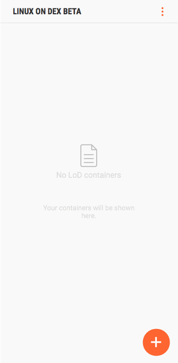
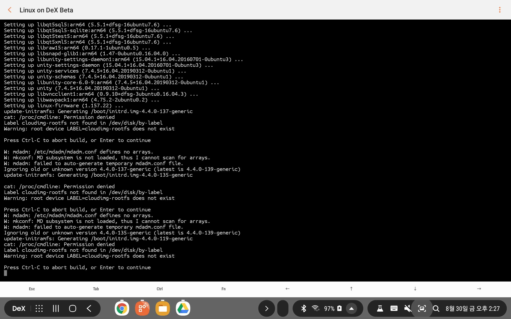

# Samsung Android 기기에서 Linux 사용하기  
---------------------

삼성이 자사의 Android 기기에서 Linux를 사용할 수 있는 환경을 제공한다.  
`VScode`와 `IntelliJ`가 탑재되어 있는 것을 보면 어디서든 개발을 하고자 하는 이들을 노린 것으로 보인다.  
[`Linux on Dex`](https://www.linuxondex.com/)가 그 이름으로,   
상세한 정보는 홈페이지를 통해 확인하기 바라며 본 글에서는 필자의 설치 과정만을 공유하고자 한다.  

- 이번에도 **공식 홈페이지에는 없는 오류**가 있어 다소의 구글링을 필요로 했다.  
- Linux Image 압축 해제 후의 용량이 11 GB를 넘으니 감안하도록 하자.  


### 1. 지원 기기  
본인의 기기가 지원 대상인지 확인한다.  
필자는 Tab S4 태블릿에 설치했다.    

<p align="center">
  
</p>
<br>  

### 2. `Linux on Dex` App 설치  
* **2019년 8월 30일 현재 `Google Play`에서 찾을 수 없다**  
별도의 링크를 이용하여 apk 파일을 다운받고 설치한다 (<a href='https://drive.google.com/open?id=10Ku57itmXIy2gnzWu7VKj8RlMcIFH9vm'>Download Link</a>)  
<br>  
  
### 3. Linux Image File 다운로드 및 압축해제    
Ubuntu 16.04 Xenial 기반 Image가 제공된다.  
* **2019년 8월 30일 현재 [공식 링크](https://webview.linuxondex.com/)에서 다운로드 오류가 발생한다**  
* Android에서는 다운로드 중 조용히 종료되고,  
* Windows에서는 다운로드 중 `취소됨` 메시지와 함께 다운로드가 중단된다.  

#### 3.1. Download  
필자는 다른 리눅스 기기(윈도 노트북의 WSL)을 사용해 wget 명령어를 이용해 다운받았다.  

```bash
$ wget https://webview.linuxondex.com/016/xenial-gnome-with-IJ-GI016.zip
```
  
<br>  

#### 3.2. Transfer to Tablet PC
그리고 Tablet으로의 전송을 위해 Google Drive에 업로드하였다. (<a href='https://drive.google.com/open?id=1rZfguyO664sjDlp340rQQXEVBHgY-oWB'>Link</a>)

#### 3.3. Image Mount
압축을 해제한 후, `Linux on Dex` app을 실행하고 압축을 해제한 image를 불러온다.  
GUI 기반이라 누구나 쉽게 할 수 있다.  

  
<br> 

### 4. 실행
GUI mode가 기본값으로 실행된다.  
sudo password는 `secret`이다.  

  
<br>  

`VS Code`와 `Intelli J`가 기본으로 설치되어 있음을 볼 수 있다.

  
<br>  

Text mode를 선택하면 GUI가 없는 터미널로 실행할 수도 있다.  
아래 그림은 `midnight commander`를 설치하여 실행한 모습이다. 
  
<br>  

### 5. 업데이트  
<a href='https://www.linuxondex.com/'>공식 홈페이지</a>에 따르면, 터미널을 실행하거나 텍스트 모드로 로그인 한 후, 리눅스 이미지를 아래와 같은 명령어를 사용하여 업데이트하라고 한다.  
* **그런데 다 잘 되다가 마지막 줄에서 에러가 난다. 아직 원인을 못찾았다.**  

```bash
$ sudo -S wget -O - https://www.linuxondex.com/lodapt/keyFile | sudo apt-key add -

$ sudo su
# sudo -S printf "deb http://www.linuxondex.com/lodapt/ /\n" >> /etc/apt/sources.list

# exit

$ sudo -S apt update
$ sudo -S apt install linux-on-dex lod-daemon
//If you have a message about changing the Configuration file, please enter 'Y'.
```

linux-on-dex의 lod-daemon에 문제가 있는 것으로 판단되어 아래와 같이 리눅스 일반 명령을 실행했으나, Permission Error 메시지와 함께 더 이상 진행이 되지 않는다. 치명적인 오류는 아닌 것 같고 단순히 업데이트가 되지 않은 듯.  

```bash
sudo apt-get upgrade
```
  
<br>  

* 이후 추가적인 구글링을 통해 conda 설치까지 성공.  
* 상세한 정보는 이후 8/30 야간에 업데이트 예정임.  


  
<br>  
