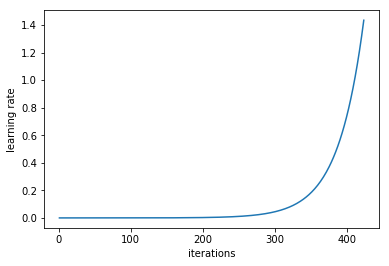
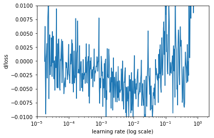
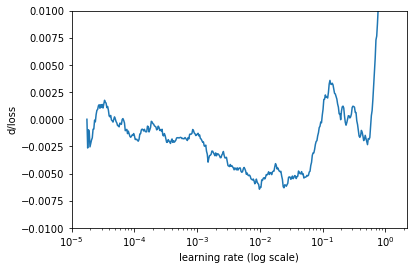

# 심층신경망에 맞는 최적 학습률 평가
> **원본 주소 :** https://towardsdatascience.com/estimating-optimal-learning-rate-for-a-deep-neural-network-ce32f2556ce0  
> **번역 철학 :** 매끄럽게 읽으실 수 있는 적절한 의역을 지향합니다.  
> **전문 용어 :** 가급적 <a href='http://taewan.kim/docs/ml_glossary/'>우리말 용어</a>를 사용하고자 하며, 원어를 병기합니다.  

<p align="center">
  
  <br>
  Source : https://www.hellobc.com.au/british-columbia/things-to-do/winter-activities/skiing-snowboarding.aspx
</p>

<br>
학습률은 심층신경망을 학습시킬 때 조정하는 가장 중요한 하이퍼파라미터 중 하나다.  

본 글에서, <a href='http://www.fast.ai/'>fast.ai 딥러닝 과정</a>에서 배운 합리적인 학습률을 찾는 간단하면서도 강력한 방법을 소개하고자 한다. 나는 이 과정의 새로운 버전을 <a href='https://www.usfca.edu/data-institute/certificates/deep-learning-part-one'>샌프란시스코 대학</a>에서 직접 수강하고 있다. 아직 일반 대중에게는 공개되지 않았지만, 올 연말께 <a href='http://course.fast.ai/'>course.fast.ai</a>를 통해 공개될 것으로 보인다. (현재는 작년 버전이 업로드 되어 있다)  
<br>
  
## 학습률은 학습에 어떻게 영향을 미치는가?
딥러닝 모델은 보통 확률적 경사 하강법(SGD: Stochastic Gradient Descent) 최적화를 통해 학습된다. 확률적 경사 하강법에는 Adam, RMSProp, Adagrad 등 많은 변종이 있다. 이들 모두 사용자가 직접 학습률을 설정하도록 되어 있는데, 최적화 알고리즘이 가중치들을 미니배치가 만들어내는 경사의 반대 방향으로 얼마나 빠르게 움직일지를 정하는 것이다.  

학습률이 낮으면, 학습의 신뢰성은 향상되지만 손실 함수의 최소값을 향하는 발걸음이 잘기 때문에 최적화에는 매우 많은 시간이 걸린다.  

학습률이 높으면, 학습은 수렴하지 않고 심지어 발산하기도 한다. 가중치 변화가 너무 크면 최적화는 커녕 최소값 반대방향으로 날아가버려 손실이 악화되기 때문이다.  

<p align="center">
  
  <br>
  학습률이 낮을 때(위)와 높을 때(아래) 경사하강 진행 과정.<br>  
  Source: Andrew Ng, Machine Learning Course on Coursera
</p>
<br>

초기에 무작위로 설정된 가중치는 최적값과 거리가 멀다. 따라서 일단 비교적 높은 학습률로 학습을 시작하고 (가중치를 최적점 근처로 조정한 후), 학습률을 줄여 미세하게 조정할 수 있다.   

학습률의 시작점을 잘 잡는 데는 여러 가지 방법이 있다. 
단순한 방법으로,다른 값 여러 개를 넣고 언제 학습 속도가 느려지지 않고 손실이 가장 적은지를 찾을 수 있다. 또는 0.1 같은 큰 값으로 시작해서 0.1, 0.001 처럼 지수적으로 낮춰갈 수도 있다. 높은 학습률로 학습을 시작하면, 손실은 개선되기는 커녕 몇 차례 반복 학습이 진행됨에 따라 오히려 증가할 수도 있다. 조금 낮은 학습률을 적용하면 처음 몇 번의 반복 학습시 손실 함수 값이 감소하는 지점들이 있다. 이 때가 사용할 수 있는 학습률의 최대치이며, 여기서 학습률을 더 높이면 학습이 수렴하지 않는다. 이 때의 학습률은 너무 커서 여러 에포크를 학습하기에는 좋지 않다. 시간이 흐를수록 신경망의 가중치들은 섬세하게 업데이트 되어야 하기 때문이다. 따라서 최대치보다 대략 1~2 자릿수가 더 낮은 학습률이 시작점으로 적합하다.  
<br>

## 더 나은 방법이 있을 것이다.
Leslie N. Smith는 2015년에 발표한 논문 "<a href="https://arxiv.org/abs/1506.01186">Cyclical Learning Rates for Training Neural Networks</a>"의 3.3절에서 학습률의 범위를 선택하는 강력한 방법을 공개했다.  

Smith가 사용한 요령은 각 배치마다 학습률을 낮은 값으로 시작해서 높은 값으로 지수적으로 증가시킨 것이다.  

<p align="center">
  
  <br>
  각 미니배치 학습률 증가 곡선
</p>
<br>

배치마다 학습률과 학습 손실을 기록하여 도시하면 아래와 같은 그림을 얻을 수 있다.  

<p align="center">
  
  <br>
  손실이 학습 초기에 감소하다가 이후 발산하기 시작한다.
</p>
<br>

첫째로 학습률이 낮을 때 손실이 천천히 감소하다 학습 속도가 점점 빨라지는데, 학습률이 너무 커지면 손실이 급상승하여 학습 과정이 발산한다.  

위 그래프에서 손실이 가장 빠르게 감소하는 한 지점을 택해야 한다.  
본 예제에서는 학습률이 0.001과 0.01 사이에 있을 때 손실 함수가 빠르게 감소했다.  

학습이 빠르게 이루어지는 지점을 찾는 또다른 방법은 손실의 변화율(반복 횟수에 대한 손실 함수의 미분값)을 구해서 학습률을 x축, 손실 변화율을 y축으로 그래프를 그리는 것이다.  

<p align="center">
  
  <br>
  손실 변화율
</p>
<br>

잡음이 많지만 이동평균선을 적용해서 평탄화(smoothing)를 해보자.

<p align="center">
  
  <br>
  단순 이동 평균선을 적용한 손실 변화율
</p>
<br>

보기에 더 낫다.  
위 그래프에서, 학습률이 대략 0.01일 때 최소값을 찾을 수 있다.  
<br>

## 구현
<a href='https://www.usfca.edu/data-institute'>USF Data Institute</a>의 Jeremy Howard와 그의 팀은 파이토치(PyTorch)를 하이레벨로 추상화한 딥러닝 라이브러리 <a href='https://github.com/fastai/fastai'>fast.ai</a>를 개발했다. Fast.ai는 첨단의 딥러닝 모델을 학습하기에 편하면서도 강력한 도구 모음(toolset)으로, Jeremy의 최신 딥러닝 강좌에서 사용되었다 (<a href='http://www.fast.ai/'>fast.ai</a>).  

Fast.ai에는 학습률을 찾아주는 기능이 구현되어 있어서, 여러분의 모델에 맞는 학습률을 찾는 데는 단 두 줄의 코드만 있으면 된다.

```python 
# learn is an instance of Learner class or one of derived classes like ConvLearner
learn.lr_find()
learn.sched.plot_lr()
```

손실 함수의 변화율을 그려주는 코드는 포함되어 있지 않지만, 간단하게 계산할 수 있다.
<br>

```python
def plot_loss_change(sched, sma=1, n_skip=20, y_lim=(-0.01,0.01)):
    """
    Plots rate of change of the loss function.
    Parameters:
        sched - learning rate scheduler, an instance of LR_Finder class.
        sma - number of batches for simple moving average to smooth out the curve.
        n_skip - number of batches to skip on the left.
        y_lim - limits for the y axis.
    """
    derivatives = [0] * (sma + 1)
    for i in range(1 + sma, len(learn.sched.lrs)):
        derivative = (learn.sched.losses[i] - learn.sched.losses[i - sma]) / sma
        derivatives.append(derivative)
        
    plt.ylabel("d/loss")
    plt.xlabel("learning rate (log scale)")
    plt.plot(learn.sched.lrs[n_skip:], derivatives[n_skip:])
    plt.xscale('log')
    plt.ylim(y_lim)

plot_loss_change(learn.sched, sma=20)
```
<br>

학습에 들어가기 전에 학습률을 단 한번 선택하는 것은 충분하지 않다는 사실을 명심하자. 학습 과정에서 최적 학습률은 감소하기 마련이다. 여러분은 동일한 학습률 탐색 과정을 주기적으로 수행함으로써 학습 후반부의 학습률도 찾아낼 수 있다.  
<br>

## 다른 라이브러리 없이 학습률 탐색 구현하기
나는 이처럼 학습률 탐색이 즉시 사용 가능한 상태로 구현된 것을 케라스(Keras)같은 다른 라이브러리에서 본 적이 없지만, 일일이 코드를 작성하기는 번거로울 수 밖에 없다. 한 번에 한 미니배치씩 학습을 여러 번 수행하되 한 미니배치마다 작은 상수를 곱해서 학습률을 조금씩 증가시키다가 손실이 앞에서 찾은 최적값보다 훨씬 커지면 (예를 들어, 현재의 손실이 최적 손실의 4배보다 커질 때) 중단하라는 코드를 작성해야 한다.  

