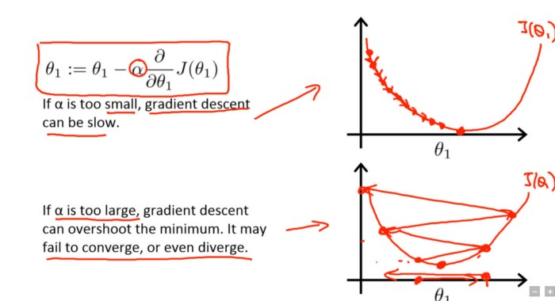

# 내 심층신경망에 맞는 최적 학습률 평가
> **원본 주소 :** https://towardsdatascience.com/estimating-optimal-learning-rate-for-a-deep-neural-network-ce32f2556ce0  
> **번역 철학 :** 매끄럽게 읽으실 수 있는 적절한 의역을 지향합니다.  
> **전문 용어 :** 가급적 <a href='http://taewan.kim/docs/ml_glossary/'>우리말 용어</a>를 사용하고자 하며, 원어를 병기합니다.  

  
   
  Source : https://www.hellobc.com.au/british-columbia/things-to-do/winter-activities/skiing-snowboarding.aspx

 
학습률은 심층신경망을 학습시킬 때 조정하는 가장 중요한 하이퍼파라미터 중 하나다.  

본 글에서, 내가 <a href='http://www.fast.ai/'>fast.ai 딥러닝 과정</a>에서 배운 합리적인 학습률을 찾는 간단하면서도 강력한 방법으로 소개하고자 한다. 나는 이 과정의 새로운 버전을 <a href='https://www.usfca.edu/data-institute/certificates/deep-learning-part-one'>샌프란시스코 대학</a>에서 직접 수강하고 있다. 아직 일반 대중에게는 공개되지 않았지만, 올 연말께 <a href='http://course.fast.ai/'>course.fast.ai</a>를 통해 공개될 것으로 보인다. (현재는 작년 버전이 업로드 되어 있다)  
 
  
## 학습률은 학습에 어떻게 영향을 미치는가?
딥러닝 모델은 보통 확률적 경사 하강법(SGD: Stochastic Gradient Descent) 최적화를 통해 학습된다. 확률적 경사 하강법에는 Adam, RMSProp, Adagrad 등 많은 변종이 있다. 이들 모두 사용자가 직접 학습률을 설정하도록 되어 있는데, 최적화 알고리즘이 가중치들을 미니배치가 만들어내는 경사의 반대 방향으로 얼마나 빠르게 움직일지를 정하는 것이다.  

학습률이 낮으면, 학습의 신뢰성은 향상되지만 손실 함수의 최소값을 향하는 발걸음이 잘기 때문에 최적화에는 매우 많은 시간이 걸린다.  

학습률이 높으면, 학습은 수렴하지 않고 심지어 발산하기도 한다. 가중치 변화가 너무 크면 최적화 과정에서 최소값과 멀어지는 방향으로 다음 값을 택하여 손실이 악화되기 때문이다.  

  
   
  학습률이 낮을 때(위)와 높을 때(아래) 경사하강 진행 도식.   
  Source: Andrew Ng, Machine Learning Course on Coursera

 

초기에 무작위로 설정된 가중치는 최적값과 거리가 멀기 때문에, 비교적 높은 학습률로 학습을 시작하는 것이 바람직하고, 이후에는 가중치를 세밀하게 업데이트할 수 있도록 학습 중에 학습률을 줄여 적용할 수 있다.  

