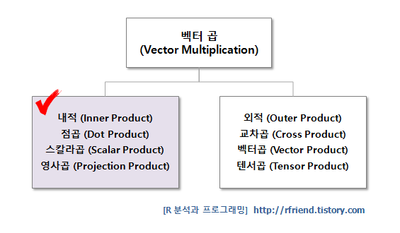
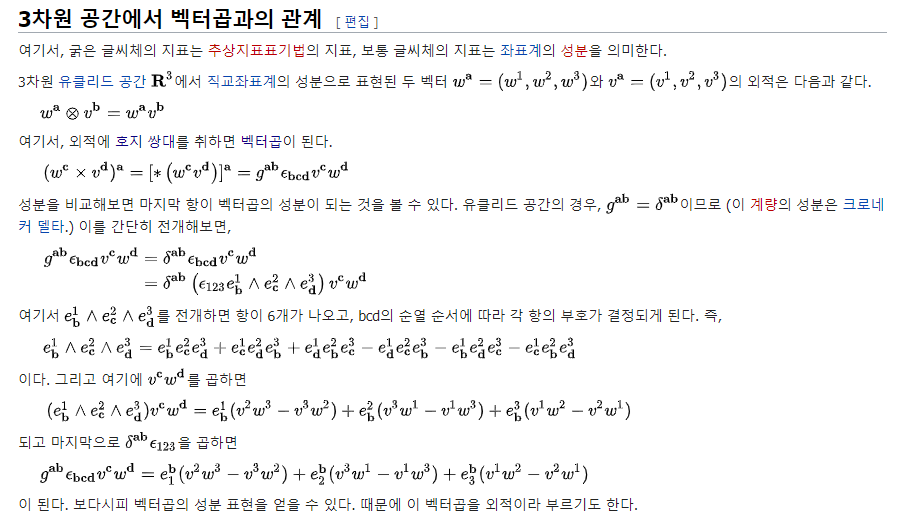

### 0. 사건의 발단

> 저와 비슷한 지식의 오류를 가진 이들을 위해 다소 장황한 이야기를 적습니다.
> 이 단락은 뛰어넘으셔도 좋습니다.

이 사건은 저의 무지와 대한수학회의 부적절한 용어 선정으로 인해 시작되었습니다.

수학을 멀리한 저는 벡터간 연산을 **내적**, **외적** 크게 두 갈래로 이해하고 (+**인자간 연산**), 내적과 외적은 같은 연산이 여러 이름을 가지고 있다고 알고 있었습니다.

그런데 `numpy`의 `vectorization`을 연습하는 과정에서 마주친 `numpy.outer()` 연산이 제가 알고 있는 그 외적이 아니더군요.

* 내가 알던 외적 = Cross Product,  `numpy.cross()`.  결과물 = **vector**. 
$$
\begin{equation}\mathbf{a} \times \mathbf{b} = \begin{bmatrix}\mathbf{i}&\mathbf{j}&\mathbf{k} \\a_{1}&a_{2}&a_{3} \\b_{1}&b_{2}&b_{3} \\\end{bmatrix} = (a_{2}b_{3}-a_{3}b_{2})\mathbf{i} + (a_{3}b_{1}-a_{1}b_{3})\mathbf{j} + (a_{1}b_{2}-a_{2}b_{1})\mathbf{k}\end{equation}
$$
* 처음 본 외적 = Outer Product,  `numpy.outer()`.  결과물 = **matrix**.

$$
\begin{equation}\mathbf{a} \otimes \mathbf{b} = \mathbf{a}\mathbf{b}^\top = \begin{bmatrix}a_{1}\\a_{2}\\a_{3}\end{bmatrix}\begin{bmatrix}b_{1}&b_{2}&b_{3}\end{bmatrix}=\begin{bmatrix}a_{1}b_{1}&a_{1}b_{2}&a_{1}b_{3}\\a_{2}b_{1}&a_{2}b_{2}&a_{2}b_{3}\\a_{3}b_{1}&a_{3}b_{2}&a_{3}b_{3}\\ \end{bmatrix}\end{equation}
$$

사건의 발단은 대한수학회에서 서로 다른 연산을 모두 `외적`으로 번역한 것입니다.

"왜 다른 연산을 같은 이름으로 부르지? 내가 알고 있던 건 뭐지?" 라는 멘탈 데미지를 입고 [wikipedia를 중심으로 구글링을 한 결과](https://ko.wikipedia.org/wiki/%EC%99%B8%EC%A0%81), 사실은 둘이 같은 것이라는 설명을 보고 2차 데미지를 입습니다.

<b>뭔말이여 이게...</b>

