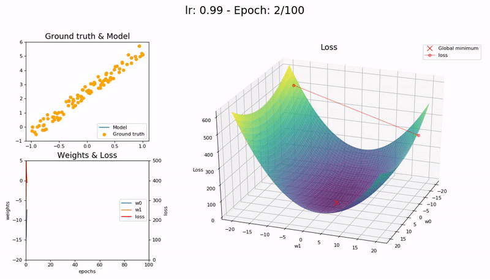

# Learning Rate 관련 문제
> 원본 : https://iconof.com/1cycle-learning-rate-policy/  
> 번역 철학 : 읽으시는 분께서 매끄럽게 읽으실 수 있도록 적절한 의역을 선호합니다.  
> 전문 용어 : 가급적 우리말 용어를 사용하고자 하며, 원 용어를 병기합니다.  

심층신경망(DNN: Deep Neural Network)은 어려운 전역 최적화 문제다.  
학습률(LR: Learning Rate)은 심층신경망 학습 조정에 결정적인 hyper-parameter인데, 학습률이 작으면 학습이 느려지고 너무 큰 값을 취하면 손실 함수 수렴이 어려워져 최소값 근처를 맴돌기만 하거나, 심지어 발산하기도 한다.  

**학습률이 너무 작을 때 (0.01)** 100 epoch 이내 수렴에 실패한다. 더 많은 Epoch - 그리고 시간 - 이 필요하다:  
  

**학습률이 좋을 때 (0.1)** 100 epoch 안에 성공적으로 수렴한다:  
  

**학습률이 최적값일 때 (0.7)** 매우 빠르게, 10 epoch 안에 수렴한다:  
  

**학습률이 클 때 (0.99)** 손실 함수가 최소값 근처를 오갈 뿐 모델이 수렴하지 않는다:  
  

**학습률이 매우 클 때 (1.01)** 모델이 빠르게 *발산*한다:  
  

(Graph 제공 : <a href='https://forums.fast.ai/t/share-your-work-here/27676/300'>José Fernández Portal</a>)  

학습률이 낮으면 느리지만 정확하다. 학습률이 증가함에 따라 학습 속도는 따라 증가하지만 학습률이 너무 커지면 발산을 해 버린다. 최적점(sweet spot)을 찾으려면 경험과 인내가 필요하다. 학습률 최적화를 자동화하는 한 가지 방법은 격자 탐색법(grid search)인데, 시간이 많이 소요된다.  
